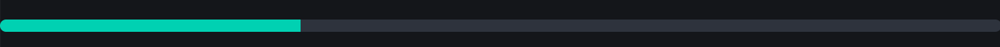
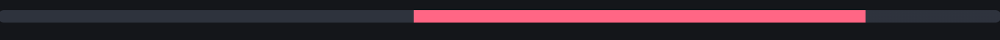
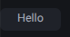

# Tool Learning Log

## Tool: **Bulma**

---

### 3/19/26:
* Using the [Bulma Website](https://bulma.io/), I learned how to make make a [menu](https://bulma.io/documentation/components/menu/).
 Menu uses syntax such as 'Menu' to initiate making a menu, 'menu-label' which tells you what the menu is about, and 'menu-list' the actual making
 for ex.
 ``` html
    <aside class="menu">
        <h3 class="menu-label"> Information </h3>
            <ul class="menu-list">
                <li> one </li>
                <li> two </li>
                <li> three </li>
            </ul>
    </aside>
```
* I had to search up what "aside" did as it was in the code. Aside was used to place stuff that have little to do with the other stuff. It is very similair to a normal list but the extra classes affect how it looks in actual code.
### (3/23/26):
#### X
* Learned to make an X in [Bulma](https://bulma.io/documentation/elements/delete/) using its website, though not interactive. Use class "delete" add on "is-#size" to change its size
* Still trying to figure out the components to make  a table in [Bulma](https://bulma.io/documentation/elements/table/). Knows it uses `<td>` for small cell.
* Table needs the "table" element which seems to be built in as an html components. It also needs
``` html
  <table>
    <tr>
      <th> Hi </th>
      <th> Hi </th>
    </tr>
    <tr>
      <td> Hi </td>
      <td> Hi </td>
    </tr>
```
*"tr" means each row of the table. "th" means the heading the first row while "td" means each cell basically each columm of a row. Bulma has certain classes that effect the tables such as just class="table", you can add on more such as bulma color classes too.*
### 3/30/26:
* Learned to use a progress bar on [Bulma](https://bulma.io/documentation/elements/progress/). The progress bar is an existing element in html but bulma makes it look a lot cleaner. It uses syntax, `<progress>` with closing and you can determine how full it is with "value". Max determines how full the value will be relative to the max. For instance:
``` html
<progress class="progress" value="30" max="100"> </progress>
```

* The class "progress" makes it look nice in a bulma format, the value is 30 and because it has a maximum of 100, the bar will look 30% full.
* On Bulma, a valueless input will instead make it look as if its loading, the value and max values are not important here. The color of both a loading and set value can also be changed with bulma class coloring. In this case "is-danger" makes it red:


``` html
<progress class="progress is-danger" max="100"> </progress>
```

### 3/15/26 - 3/17/26
 #### [Tags](https://bulma.io/documentation/elements/tag/)
 Tags is a way to format a word in a block. Using a div as well as , it allows you to make a word better standout, the code is actually quite simple to write:<br>
<br>
Code:
``` html
<div class="tag">
  <span class="tag" > Hello</span>
</div>
```
There are many ways to edit the tag wether it be adding color, changing its size or adding properties like a delete using the `is-delete`, learnt before or hover.
#### [Panel](https://bulma.io/documentation/components/panel/)
Panels are like navbar where they allow you to navigate to different groups you've placed. 


<!--
* Links you used today (websites, videos, etc)
* Things you tried, progress you made, etc
* Challenges, a-ha moments, etc
* Questions you still have
* What you're going to try next
-->
